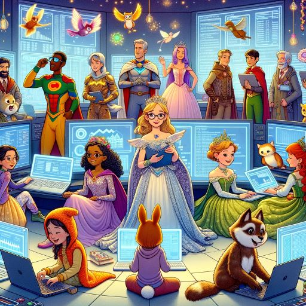

# SQL and Database Management Using Pop Culture

### Brendan Shea, PhD | Rochester Community and Technical College
Welcome to "SQL and Database Management Using Pop Culture," a GitHub repository that leads a double life as an interactive Database and SQL textbook. Through this innovative approach, we blend the technical world of SQL and database management with the relatable and often thrilling realm of pop culture. This book is designed to make the complex concepts of databases not just understandable but genuinely enjoyable to learn.

**Why This Book?**  Databases are the backbone of the modern data-driven world, yet their intricacies can often seem labyrinthine to learners. This book demystifies these complexities by drawing parallels with popular culture, weaving a narrative that is both informative and relatable. Whether you are a student stepping into the world of databases or a professional seeking to deepen your understanding, this book provides a fresh perspective that is both comprehensive and accessible. The book starts with basic queries in **SQLite**, and move on to introduce both **PostgreSQL** and **MySQL** in later chapters. The content is aligned with the content of the **CompTia Data Sys+** and **Oracle Database Foundations** exams.

**The Structure of the Book.** Each chapter of this book is crafted like an episode of a TV series, where learning SQL and database management becomes an adventure rather than a routine academic endeavor. Here's what awaits you in this journey:

-   Chapter 0: Get started with an interactive introduction to SQL and Python in Colab notebooks.
-   Chapters 1 to 12: From the deck of the Star Trek Enterprise to the magical corridors of Hogwarts, dive into every aspect of SQL and database management. Each chapter unfolds a new scenario, tying complex database concepts to familiar stories and characters from pop culture.

This repository houses twelve Jupyter notebooks, making the learning experience highly interactive and hands-on. You'll not just read about SQL queries and database theories but also get to experiment and see the results in real-time.

# Chapters 

**Ch 0: Introduction to Colab with Brendan --** 
   [Brendan's_Intro_to_Colab.ipynb](https://github.com/brendanpshea/database_sql/blob/main/Chapter_0_Brendan's_Intro_to_Colab.ipynb): Embark on your SQL journey by mastering the use of SQL and Python in Google Colab notebooks. This introductory chapter sets the stage for integrating database queries with Python code, offering a seamless learning experience for beginners.

**Ch 1: Data and Databases: A Star Trek Adventure --** 
   [Database_01_Intro.ipynb](https://github.com/brendanpshea/database_sql/blob/main/Database_01_Intro.ipynb): Navigate the vastness of space and data with the Star Trek Enterprise. Learn the foundational concepts of databases, distinguishing them from flat files, and explore how databases organize and store data for efficient retrieval and analysis.

**Ch 2: Relational Databases at Unseen University --** 
   [Database_02_RelationalModel_SQL.ipynb](https://github.com/brendanpshea/database_sql/blob/main/Database_02_RelationalModel_SQL.ipynb): Dive into the fundamentals of relational databases and SQL at Terry Pratchett's Unseen University. Master key SQL commands like `SELECT`, `FROM`, and `WHERE` to query and manipulate data effectively.

**Ch 3: Mastering SQL with Tony Stark --** 
   [Database_03_Stark's_SQL_Secrets.ipynb](https://github.com/brendanpshea/database_sql/blob/main/Database_03_Stark's_SQL_Secrets.ipynb): Join Tony Stark to uncover advanced SQL functions for mathematics, string manipulations, and data operations. Delve into essential aspects of database security and data governance, crucial for protecting sensitive information.

**Ch 4: Aggregates and Subqueries in the World of Goodreads --**  
   [Database_04_Aggregates_Subqueries_SQL.ipynb](https://github.com/brendanpshea/database_sql/blob/main/Database_04_Aggregates_Subqueries_SQL.ipynb): Analyze Goodreads data using SQL's aggregate functions and subqueries. Learn to group and summarize data, creating powerful data insights through intricate querying techniques.

**Ch 5: JOIN Operations and Set Theory in SQL with IMDB --**  
   [Database_05_Joins_Sets_SQL.ipynb](https://github.com/brendanpshea/database_sql/blob/main/Database_05_Joins_Sets_SQL.ipynb): Explore the Internet Movie Database with JOIN operations and set theory concepts in SQL. Understand how to combine data from different tables effectively, enhancing the power and flexibility of your data queries.

**Ch 6: Data Modeling and ER Diagrams with Wednesday Addams --**  
   [Database_06_Data_Modeling_and_ER_Diagrams.ipynb](https://github.com/brendanpshea/database_sql/blob/main/Database_06_Data_Modeling_and_ER_Diagrams.ipynb): Join Wednesday Addams in creating data models and Entity Relationship (ER) Diagrams for her "Web Shop." Learn the art of structuring and visualizing database schemas, a crucial skill in database design.

**Ch 7: Advanced Modeling: Lessons from Hogwarts --** 
   [Database_07_Advanced_Modeling.ipynb](https://github.com/brendanpshea/database_sql/blob/main/Database_07_Advanced_Modeling.ipynb): Advance your data modeling skills with lessons from Hogwarts. Delve into complex topics such as data normalization and understanding subtype relationships to ensure data integrity and efficiency.

**Ch 8: Database Management: Insights from The Office --** 
   [Database_08_Database_Managment.ipynb](https://github.com/brendanpshea/database_sql/blob/main/Database_08_Database_Managment.ipynb): Gain practical insights into database management with scenarios inspired by The Office. Topics include generating test data, implementing views and indexes, performing query analytics, and managing user accounts.

**Ch 9: Monsters of JSON and XML: A D&D Adventure --** [Database_09_Monsters_of_JSON.ipynb](https://github.com/brendanpshea/database_sql/blob/main/Database_09_Monsters_of_JSON.ipynb): Battle the beasts of JSON data format in a Dungeons and Dragons setting. Learn about the uses and pitfalls of SQL and NoSQL databases while dealing with Monster Stats.

**Ch 10: Database Lifecycle: A Journey with ELoise Query-Hopper --** [Database_10_DatabaseLifecycle.ipynb](https://github.com/brendanpshea/database_sql/blob/main/Database_10_DatabaseLifecycle.ipynb): Follow the database lifecycle through a narrative with ELoise Query-Hopper, a Junior DBA at Princeton Plainsborough Hospital. Review key learnings in line with the CompTia Data+ Certification.

**Ch 11: Data Warehouses and Zombies --** [Database_11_Data_Warehouses.ipynb](https://github.com/brendanpshea/database_sql/blob/main/Database_11_Data_Warehouses.ipynb): Delve into data warehouses, ETL processes, Star Schema, and Pandas, all while managing a Zombie outbreak.

**Ch 12: Comprehensive Review and Oracle Exam Prep --**  [Database_12_Review.ipynb](https://github.com/brendanpshea/database_sql/blob/main/Database_12_Review.ipynb): A thorough review of all concepts covered in this series, serving as a study guide for the Oracle Database Foundations exam.

# Computing Concepts With Python
### Brendan Shea, PhD | Brendan.Shea@rctc.edu
Embark on an engaging journey into the world of computing with "Computing Concepts with Python," an interactive textbook designed to make learning Python and fundamental computing concepts not just informative but genuinely enjoyable. Whether you're a complete beginner or looking to deepen your understanding, this textbook offers a hands-on approach to learning. Through a series of well-crafted Jupyter notebooks, you'll explore everything from the basics of Python programming to the intricacies of artificial intelligence, cybersecurity, and data management. Each chapter is packed with interactive elements that allow you to experiment, code, and immediately see the results of your work. This isn't just a textbook; it's a dynamic learning experience that adapts to your pace and style.

"Computing Concepts with Python" is a resource that transforms the teaching landscape. As an Open Educational Resource, it is freely accessible, allowing you to integrate it seamlessly into your curriculum. Each chapter is meticulously structured to provide comprehensive coverage of key computing topics while encouraging active learning. The interactive notebooks are perfect for classroom demonstrations, homework assignments, or as a foundation for more advanced projects. With this textbook, you're not just providing information; you're offering an immersive educational tool that sparks curiosity, fosters critical thinking, and prepares students for the challenges of the modern technological world.

If you've never used Google Colab before, I think you'll find it's pretty intutive. I've put together a tutorial here: [Ch 0: Brendan's Colab Tutorial](https://colab.research.google.com/github/brendanpshea/computing_concepts_python/blob/main/IntroCS_00_Intro_to_Colab.ipynb).

### [Ch 1: Computers and Hardware](https://colab.research.google.com/github/brendanpshea/computing_concepts_python/blob/main/IntroCS_01_ComputersHardware.ipynb)
 This chapter welcomes students to the study of computer science, emphasizing the interactive lecture notes as the class's primary resource. It offers an introductory lecture on computer hardware, aiming to provide an understanding of the physical components of computers. The chapter covers topics such as processors, memory, storage devices, and input/output mechanisms. It emphasizes the importance of understanding computer hardware as the foundation for software interactions and computational tasks.

### [Ch 2: Files and Formats](https://colab.research.google.com/github/brendanpshea/computing_concepts_python/blob/main/IntroCS_02_Files_and_Formats.ipynb)
This chapter dives into the concept of digital files and formats, using engaging examples like digital artwork, reports, and music recordings to explain the necessity of files as a digital home for various data types. The focus is on understanding the different file types and formats, their specific uses, and the importance of choosing the right format for different kinds of data. This chapter is crucial for grasping how data is stored, accessed, and shared in the digital world.

### [Ch 3: Computer Networking](https://colab.research.google.com/github/brendanpshea/computing_concepts_python/blob/main/IntroCS_03_Networks.ipynb)
This chapter introduces the concept of computer networking, defining a network as a collection of interconnected devices capable of communication. It covers a range of devices, from traditional computers and smartphones to IoT devices like smart fridges. The focus is on the role of networks in facilitating data and resource sharing, making processes more efficient and collaborative. The chapter explores different types of networks, network protocols, and the practical aspects of using networks for data transmission.

### [Ch 4: Intro to Python: Strings](https://colab.research.google.com/github/brendanpshea/computing_concepts_python/blob/main/IntroCS_04_IntroToPython_Strings.ipynb)
This chapter introduces students to Python as a programming language, drawing an analogy to human languages to explain its purpose and use. The focus of the chapter is on strings, a fundamental data type in Python, exploring how they are used and manipulated within the language.

### [Ch 5: Data Types and Functions](https://colab.research.google.com/github/brendanpshea/computing_concepts_python/blob/main/IntroCS_05_IntsFloatsFunctions.ipynb)
This chapter delves into data types and functions in Python, emphasizing their role as foundational elements in programming. It aims to familiarize students with different data types, particularly integers and floating-point numbers, and how these types organize and manage information in code. The chapter introduces the concept of functions, explaining how they are used to perform specific tasks and handle data in Python.

### [Ch 6: Conditionals and Levels of Abstraction](https://colab.research.google.com/github/brendanpshea/computing_concepts_python/blob/main/IntroCS_06_Conditionals.ipynb)
 Focusing on conditionals and program flow control, this chapter introduces students to the concept of 'abstraction' in computer science. It discusses how conditionals, such as 'if', 'else', and 'elif' statements, are used to direct the execution flow of a program based on specific conditions. The chapter explores various examples and scenarios where conditionals are crucial in decision-making processes within programs.

### [Ch 7: Algorithms and Loops](https://colab.research.google.com/github/brendanpshea/computing_concepts_python/blob/main/IntroCS_07_Algorithms_and_Loops.ipynb)
This chapter introduces the concept of algorithms as step-by-step procedures or rules for solving problems and accomplishing tasks, both in everyday life and computing. It highlights the importance of algorithms as the foundation of computer programs and applications, and how they are used in various decision-making processes. The chapter likely covers different types of algorithms and introduces loops as a means to execute repetitive tasks efficiently in programming.

### [Ch 08: Cybersecurity](https://colab.research.google.com/github/brendanpshea/computing_concepts_python/blob/main/IntroCS_08_CyberSecurity.ipynb)
 Addressing the critical importance of cybersecurity in the digital age, this chapter delves into the need to protect digital assets and personal information. It provides an overview of key cybersecurity concepts, real-world examples, and simple Python examples where applicable. The chapter is designed to raise awareness and understanding of cybersecurity threats and measures, making it relevant for students in today's technology-reliant world.

### [Ch 09: An Intro to Data and Databases](https://colab.research.google.com/github/brendanpshea/computing_concepts_python/blob/main/IntroCS_09_Data_and_Databases.ipynb)
This chapter deals with the vast and crucial world of data and databases. It explains the concept of data, its various types, and its critical role in computer science and decision-making across different fields. The chapter introduces databases as tools for efficiently storing, managing, and retrieving data, underlining their significance in handling the ever-growing volume of digital information.

### [Ch 10: From Data Structures to Software Engineering](https://colab.research.google.com/github/brendanpshea/computing_concepts_python/blob/main/IntroCS_10_DictionariesObjectsTests.ipynb)
This chapter transitions students into more advanced topics, starting with Python dictionaries, a versatile data structure. It then explores object-oriented programming by introducing objects, a crucial concept in modern software development. The chapter also covers the art of testing code, emphasizing the importance of this practice for ensuring code reliability and functionality. Additionally, it touches upon fundamental software engineering methodologies, providing a comprehensive overview of these key areas in computer science.

### [Chapter 11: Artificial Intelligence (AI)](https://colab.research.google.com/github/brendanpshea/computing_concepts_python/blob/main/IntroCS_11_ArtificialIntelligence.ipynb)
This a pivotal area of computer science focused on creating machines that can simulate human intelligence. This chapter dives into the core aspects of AI, including learning, reasoning, and self-correction. Students will explore the development of AI through examples like chess-playing programs and natural language processing (NLP) systems. The chapter differentiates between **narrow AI**, designed for specific tasks such as facial recognition, and **general AI**, which mimics human-level intelligence across various domains. It also covers subfields like machine learning and deep learning, illustrating how AI is a rapidly evolving field. This chapter provides a comprehensive overview of AI's history, current applications, and its potential future developments.

### [Chapter 12: Applied AI](https://colab.research.google.com/github/brendanpshea/computing_concepts_python/blob/main/IntroCS_12_AppliedAI.ipynb)
Chapter 12, "Applied AI," introduces students to practical applications of artificial intelligence, specifically focusing on the development of a chatbot inspired by the television series "Futurama." The chapter begins by guiding students through the creation of a simple chatbot, explaining key programming concepts such as string manipulation and regular expressions. It then delves into more advanced features, including pattern matching and using regular expressions to handle user inputs. Students then learn about image manipulation with OpenCV, and the use of generative AI for programming.  This chapter is an excellent demonstration of how AI can be creatively applied, offering an engaging and practical approach to understanding and implementing AI concepts. Students will not only learn the technical skills required for AI development but also appreciate the versatility and creativity involved in AI applications. ​

**A Note on the Use of AI Tools.** These chapters were intitially developed as the “generative AI” explosion took off (staring with OpenAI’s GPT 3.0), and I’ve had fun experimenting with many of these tools—including successive versions of ChatGPT, Google Bard, Claude, Codey, CoPilot, and others—in helping to turn my (voluminous, but often unorganized) lecture notes into something resembling a proper book. My experience was these tools with these has been generally positive, and I think that they can someday do at least some of the work done by traditional editors and publishing houses (I say this as a former editor at an academic press!). I’m less convinced they are going to immediately replace the actual *writer* or *programmer*, though, as there’s still a fair amount of expertise (and effort!) into producing quality, meaningful output.

# About the Author
Brendan Shea, PhD, is Professor of Philosophy and Computer Science at Rochester Community and Technical College and a Resident Fellow at the Minnesota Center for Philosophy of Science at the University of Minnesota-Twin Cities. He also serves as the Public Member of the Institutional Biosafety Committee at Mayo Clinic-Rochester. His main research and teaching interests lie in the philosophy of science, data modeling, applied ethics, and in the areas where these overlap (such as bioethics and the ethics of artificial intelligence). You can find out more about his research here: https://philpeople.org/profiles/brendan-shea
