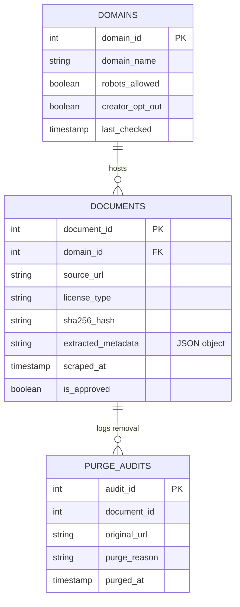

## Executive Summary

The rapid advancement of generative artificial intelligence (AI) has been fueled by massive quantities of text, images, and source code scraped from the open web. While these datasets have enabled breakthrough capabilities in models like GPT-4, Claude, Midjourney, and GitHub Copilot, they have sparked intense legal and ethical conflicts. Content creators, artists, and software developers increasingly argue that their intellectual property has been scraped and ingested without their consent, compensation, or attribution. 

This case study examines the intersection of automated data collection (web scraping) and copyright law, analyzing the ethical boundaries of AI training datasets. It bridges the gap between ethical principles and database operations, demonstrating how relational database schemas can be designed to track content provenance, respect licensing agreements, and enforce user opt-out requests at scale.

::: {.callout-note}
### Core Concepts Covered
*   **Data Provenance**: Tracking the origin, ownership, and license conditions of database records.
*   **Informed Consent & Opt-Outs**: Relational methods for managing creator choices and filtering datasets.
*   **AI Training Audits**: Writing SQL queries to validate dataset licensing and ensure copyright compliance before model training.
:::

---

## The Scenario

In the race to build state-of-the-art Large Language Models (LLMs) and art generation engines, tech companies deploy specialized web scrapers—automated crawlers or "spiders"—that traverse millions of websites daily. These crawlers extract text, images, and source code, saving them into massive, structured databases (often stored as CSV, JSON, or columnar files) before feeding them to deep learning neural networks.

As AI models began generating human-like writing, stunning artwork in the styles of living illustrators, and complex code snippets, three high-profile controversies emerged:

1.  **Large Language Models and the "Books3" Dataset**:
    In 2021, investigators revealed that several prominent LLMs had been trained on "Books3," a text corpus containing over 190,000 copyrighted books scraped from pirated repositories. Authors discovered that these AI models could summarize their books page-by-page, essentially copying their work without consent or royalties.
2.  **AI Art Generators and Image Scraping**:
    Image models like Stable Diffusion and Midjourney were trained on millions of images scraped from galleries like ArtStation, Flickr, and Pinterest. Illustrators found the AI generating exact stylistic replicas of their signature art styles, competing directly with them in the marketplace and devaluing human creativity.
3.  **Code Completion Engines and Open-Source Licensing**:
    Tools like GitHub Copilot were trained on billions of lines of public source code from open-source repositories. Developers noticed the AI generating unique copyrighted algorithms without complying with their associated open-source licenses (such as the GPL or MIT licenses, which require proper attribution and sharing of derivative work).

---

## The Ethical Dilemma

The collection of open-web data for AI training presents a fundamental conflict between **technological innovation** and **individual rights**:

*   **Copyright and Fair Use**: AI developers argue that training models is "transformative" and falls under the **Fair Use doctrine**—similar to a human reading books to learn how to write. Content creators counter that AI systems do not merely learn; they build commercial products that directly compete with the original creators using their own scraped intellectual property.
*   **Privacy & Inadvertent Harvesting**: Web scrapers capture data indiscriminately, harvesting personal email addresses, phone numbers, sensitive opinions, and private forum posts. Under regulations like the European Union's **General Data Protection Regulation (GDPR)** and the **California Consumer Privacy Act (CCPA)**, individuals have a "Right to be Forgotten" (data erasure), which is incredibly difficult to enforce once data is baked into an AI model's weights.
*   **Consent and Autonomy**: Traditional web browsing operates under the assumption of human readership. Scraping millions of assets at scale bypasses traditional licensing markets, forcing creators to choose between removing their content from the web entirely or letting private tech companies use it to build competing software.

---

## Database & SQL Considerations

To prevent legal liability and uphold ethical standards, modern data companies do not scrape blindly. They use a **relational database management system (RDBMS)** to establish **data provenance**—the documented history of a record’s origin, licensing, and consent status.

Before any data is passed to the AI training pipeline, database administrators (DBAs) enforce strict integrity rules. They design tables to store:
*   The domain's scraping permissions (e.g., `robots.txt` directives).
*   The copyright/licensing status of every scraped document.
*   Creator opt-out requests, ensuring opted-out content is immediately purged or filtered.
*   Cryptographic hash checks (SHA-256) to validate data integrity.

### The Provenance Tracking Schema

Below is a relational schema designed to enforce ethical scraping and compliance checks:



### Implementing the Compliance Schema (DDL)

The following SQL DDL statements create the tables and enforce check constraints to prevent the ingestion of unauthorized data:

```sql
-- DDL definition for the Provenance Tracking System
CREATE TABLE domains (
    domain_id INTEGER PRIMARY KEY AUTOINCREMENT,
    domain_name TEXT UNIQUE NOT NULL,
    robots_allowed BOOLEAN DEFAULT 1,
    creator_opt_out BOOLEAN DEFAULT 0, -- Set to 1 if domain or creator requests an opt-out
    last_checked TIMESTAMP DEFAULT CURRENT_TIMESTAMP
);

CREATE TABLE documents (
    document_id INTEGER PRIMARY KEY AUTOINCREMENT,
    domain_id INTEGER NOT NULL,
    source_url TEXT UNIQUE NOT NULL,
    license_type TEXT CHECK(license_type IN ('Public Domain', 'Creative Commons', 'MIT', 'GPL', 'Proprietary', 'Unknown')),
    sha256_hash TEXT UNIQUE NOT NULL,
    extracted_metadata TEXT, -- JSON column containing author, word count, publication date, etc.
    scraped_at TIMESTAMP DEFAULT CURRENT_TIMESTAMP,
    is_approved BOOLEAN DEFAULT 0,
    FOREIGN KEY (domain_id) REFERENCES domains(domain_id) ON DELETE CASCADE
);

CREATE TABLE purge_audits (
    audit_id INTEGER PRIMARY KEY AUTOINCREMENT,
    original_url TEXT NOT NULL,
    purge_reason TEXT NOT NULL,
    purged_at TIMESTAMP DEFAULT CURRENT_TIMESTAMP
);
```

### Querying to Enforce Ethical Safeguards

#### 1. Filtering Out Opted-Out Datasets
Before training, the database engine must generate a clean dataset containing only approved files from domains that have *not* requested an opt-out:

```sql
-- Retrieve all approved scraped documents that are ethically cleared for AI training
SELECT 
    d.document_id,
    dom.domain_name,
    d.source_url,
    d.license_type,
    d.sha256_hash
FROM 
    documents d
    JOIN domains dom ON d.domain_id = dom.domain_id
WHERE 
    dom.creator_opt_out = 0  -- Filter out domains that requested opt-outs
    AND dom.robots_allowed = 1 -- Filter out domains that forbid crawlers in robots.txt
    AND d.is_approved = 1;     -- Ensure document has passed basic curation checks
```

#### 2. Identifying and Auditing Flagged Licenses
If an LLM must only be trained on open-source code or Creative Commons assets, we write a query to isolate and audit any `Proprietary` or `Unknown` licenses:

```sql
-- Count and list documents by license type to audit potential copyright risks
SELECT 
    license_type,
    COUNT(*) AS total_documents,
    AVG(LENGTH(extracted_metadata)) AS avg_meta_size
FROM 
    documents
GROUP BY 
    license_type
ORDER BY 
    total_documents DESC;
```

#### 3. Enforcing Purge Compliance (The Right to be Forgotten)
When a creator issues a copyright takedown request or invokes the GDPR Right to Erasure, a database transaction must delete their documents and log the action in the audit table for legal compliance:

```sql
-- Simulate a copyright purge transaction for a specific domain
-- Step A: Log the deletion in our compliance audit table
INSERT INTO purge_audits (original_url, purge_reason)
SELECT source_url, 'GDPR Right to Be Forgotten / Copyright Takedown Request'
FROM documents
WHERE domain_id = (SELECT domain_id FROM domains WHERE domain_name = 'piratedbooks.example.com');

-- Step B: Delete the actual documents from the database (cascades or purges)
DELETE FROM documents
WHERE domain_id = (SELECT domain_id FROM domains WHERE domain_name = 'piratedbooks.example.com');

-- Step C: Mark the domain status as opted-out to prevent future crawls
UPDATE domains
SET creator_opt_out = 1
WHERE domain_name = 'piratedbooks.example.com';
```

---

## Discussion Questions

1.  **Innovation vs. Property**: Do you believe that using copyrighted material to train generative AI models is "Fair Use" (since the models learn patterns and write new things) or is it copyright infringement (since they use full copies of the work during training)? Defend your position.
2.  **Database Provenance Design**: Examine the proposed `documents` schema. What additional attributes or logging tables would you add if you needed to track user-level consent (e.g. users on a blogging platform opting-out individually) rather than domain-level opt-outs?
3.  **The Purge Practicality**: Once a deep learning neural network has been fully trained on a dataset, it is technically impossible to "un-train" it on individual records without completely retraining the model from scratch (which costs millions of dollars). Under privacy laws like the GDPR, if a user demands the deletion of their database records, does removing them from the SQL database suffice if their "learned patterns" remain in the active AI model? How should compliance officers address this?

---

## Key Takeaways

*   **Explicit Provenance is Required**: Every database containing scraped content must maintain **data provenance** metadata, linking every record back to its source domain, license type, and date of acquisition.
*   **Consent Must Be Actionable**: Opt-out preferences (e.g. from `robots.txt` or manual creator contact) must be stored as **actionable constraints** in the database layer, allowing queries to dynamically filter out restricted files in real time.
*   **Compliance Auditing Saves Legal Costs**: Regularly run **license audit queries** to verify that zero proprietary or pirated records are present in the active dataset, preventing severe copyright lawsuits before the model is compiled.
