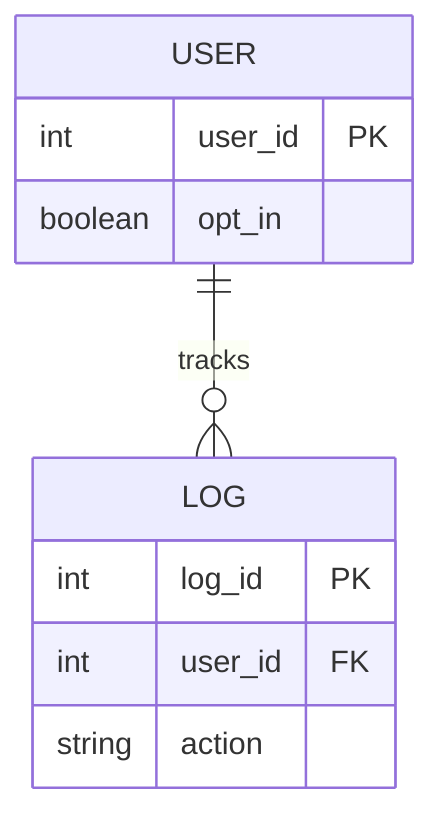

## Executive Summary

*A concise, one-paragraph abstract summarizing the ethical scenario, the core data governance conflict, and its technical database relevance.*

::: {.callout-note}
### Core Concepts Covered
*   *Key Concept 1 in a full sentence.*
*   *Key Concept 2 in a full sentence.*
*   *Key Concept 3 in a full sentence.*
:::

---

## The Scenario

*An engaging, narrative-driven case story that establishes the setting, the characters (pop-culture or realistic enterprise settings), and the specific actions that led to the conflict. Written in natural, flowing academic textbook prose.*

---

## The Ethical Dilemma

*A deep-dive analysis of the ethical conflict under standard frameworks (e.g. data privacy, user consent, ownership, or intellectual property rights). Written in a cohesive narrative structure, avoiding structured lists.*

---

## Database & SQL Considerations

*This section bridges the gap between raw ethics and database management. It prioritizes visual graphics (Mermaid diagrams) to show how data is structured, accompanied by short, well-explained code snippets.*

### Graphic Depiction of the Schema

*A visual Mermaid Entity-Relationship diagram showing the clean, ethically designed database schema.*



### Key DDL & Query Concepts

*A brief, 3-to-5 line code snippet illustrating a crucial database constraint or filtering mechanism, followed by a detailed paragraph explaining its real-world function.*

```sql
-- Minimal illustrative SQL showing the key concept
SELECT user_id, action FROM logs
WHERE opt_in = 1;
```

*Explanation of how this specific database design enforces ethical standards.*

---

## Discussion Questions

1.  **Dilemma Debate**: An open-ended question prompt urging students to debate two competing ethical viewpoints or business priorities.
2.  **Student Analogy**: A question asking students to construct their own real-world analogy or personal example to illustrate a concept from this case.
3.  **Database Design Trade-off**: A problem-solving question asking students to weigh the technical or usability trade-offs of the database solutions proposed in this case.
4.  **Regulatory & Social Impact**: An open-ended prompt exploring the long-term societal, legal, or institutional consequences of these data practices.
5.  **Policy Drafting**: A scenario-based question asking students to roleplay as a lead DBA or compliance officer and draft a basic operational policy for their organization.

---

## Key Takeaways

*   *First major standard or best practice explained in a complete, natural sentence.*
*   *Second major standard or best practice explained in a complete, natural sentence.*
*   *Third major standard or best practice explained in a complete, natural sentence.*
